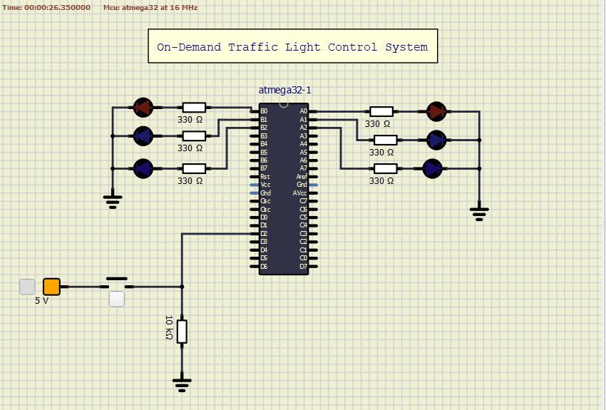
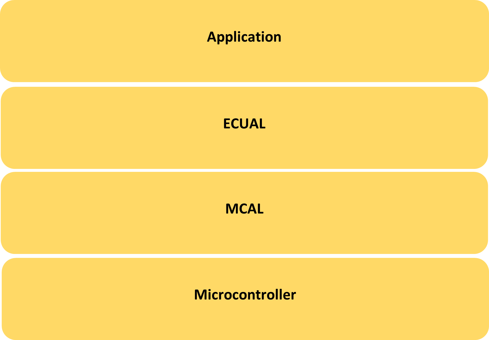
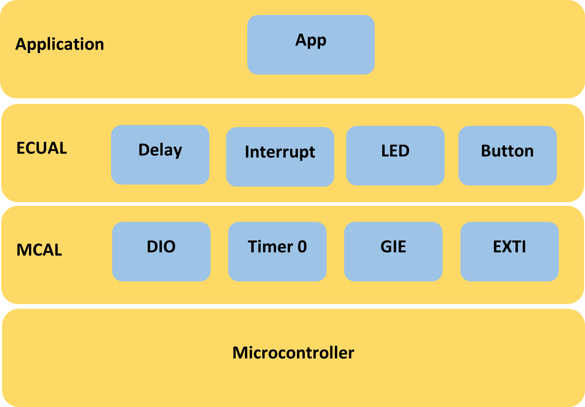
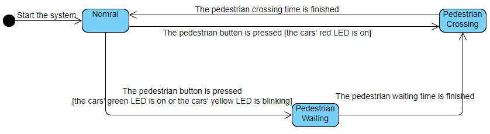

# On-Demand Traffic Light Control System
The system is a traffic light system having two modes: the normal mode and the pedestrian mode. The normal mode is used by cars, and the pedestrian mode is used by pedestrians wanting to cross the street. Each mode is represented with 3 LEDs: GREEN, YELLOW, and RED connected to two different MCU ports: PORTA and PORTB. There is a button connected to a pin in MCU PORTD to go from the normal mode to the pedestrian mode.  Simply, when a pedestrian wants to cross the street, it presses the button. Then the lighting sequence of the LEDs will be managed in some way to allow the pedestrian to cross street without any accidents.
For the sake of explanation, the LED sequence of each mode and how each mode is entered and leaved, I will use the term Cars’ LED to refer to the normal mode LEDS and the term Pedestrians’ LED to refer to the pedestrian mode LEDs. 



### Normal Mode
1.	Cars' LEDs will be changed every five seconds starting from Green then yellow then red then yellow then Green.
2.	The Yellow LED will blink for five seconds before moving to Green or Red LEDs.

### Pedestrian Mode
1.	Change from normal mode to pedestrian mode when the pedestrian button is pressed.
2.	If pressed when the cars' Red LED is on, the pedestrian's Green LED and the cars' Red LEDs will be on for five seconds, this means that pedestrians can cross the street while the pedestrian's Green LED is on.
3.	If pressed when the cars' Green LED is on or the cars' Yellow LED is blinking, the pedestrian Red LED will be on then both Yellow LEDs start to blink for five seconds, then the cars' Red LED and pedestrian Green LEDs are on for five seconds, this means that pedestrian must wait until the Green LED is on.
4.	At the end of the two states, the cars' Red LED will be off and both Yellow LEDs start blinking for 5 seconds and the pedestrian's Green LED is still on.
5.	After the five seconds the pedestrian Green LED will be off, and both the pedestrian Red LED and the cars' Green LED will be on.
6.	Traffic lights signals are going to the normal mode again.

# System Design

### System Layers
The system consists of 4 layers from top to bottom:
1.	Application layer
2.	Electronic control unit abstraction layer (ECUAL)
3.	Microcontroller unit abstraction layer (MCAL)
4.	Microcontroller layer



### System Drivers
The system consists of the following drivers: DIO, Timers, Global Interrupts (GIE), External Interrupts (EXTI), LED, Button, Interrupts, Delay. 



### System API
Check the project documentation for the full description of each driver API.
#### DIO Driver
```C
En_dioError_t DIO_init(En_dioPort_t portNumber, En_dioPin_t pinNumber, En_dioDirection_t direction);
En_dioError_t DIO_write(En_dioPort_t portNumber, En_dioPin_t pinNumber, En_dioValue_t value);
En_dioError_t DIO_read(En_dioPort_t portNumber, En_dioPin_t pinNumber, uint8_t* value);
En_dioError_t DIO_toggle(En_dioPort_t portNumber, En_dioPin_t pinNumber);
```
#### Timer 0 Driver
```C
En_timerError_t TIMER0_init(uint8_t timerInitValue);
En_timerError_t TIMER0_start(En_timerPrescaler_t clockPrescaler);
En_timerError_t TIMER0_getState(void);
En_timerError_t TIMER0_stop(void);
```
#### GIE Driver
```C
En_gieError_t GIE_enable(void);
En_gieError_t GIE_disable(void);
```
#### EXTI Driver
```C
En_extiError_t EXTI_int0Init(void);
En_extiError_t EXTI_int0SetCallback(void(*int0Func)(void));
En_extiError_t EXTI_int0SetInterruptTrigger(En_interruptTrigger_t interruptTrigger);

```
#### LED Driver
```C
En_ledError_t LED_init(En_dioPort_t ledPort, En_dioPin_t ledPin);
En_ledError_t LED_on(En_dioPort_t ledPort, En_dioPin_t ledPin);
En_ledError_t LED_off(En_dioPort_t ledPort, En_dioPin_t ledPin);
En_ledError_t LED_toggle(En_dioPort_t ledPort, En_dioPin_t ledPin);
En_ledError_t LED_read(En_dioPort_t ledPort, En_dioPin_t ledPin, uint8_t* data); 
```

#### Button Driver
```C
En_buttonError_t BUTTON_init(En_dioPort_t buttonPort, En_dioPin_t buttonPin);
En_buttonError_t BUTTON_read(En_dioPort_t buttonPort, En_dioPin_t buttonPin, uint8_t* value);
```
#### Delay Driver
```C
void setDelayInMsec(uint16_t delay);
``` 
#### Interrupt Driver
```C
En_interruptError_t INTERRUPT_GIE_enable(void);
En_interruptError_t INTERRUPT_GIE_disable(void);
En_interruptError_t INTERRUPT_EXTI_int0Init(void);
En_interruptError_t INTERRUPT_EXTI_int0SetCallback(void(*int0Func)(void));
En_interruptError_t INTERRUPT_EXTI_int0SetInterruptTrigger(En_interruptTrigger_t interruptTrigger);
```

#### Application Driver
```C
En_appError_t APP_init(void);
En_appError_t APP_start(void);
```

## System State Diagram
The system can be visualized using state transition diagram where the system has three states: normal, pedestrian waiting, and pedestrian crossing. 



When the system starts, it enters the normal state.
If the pedestrian button is pressed while the cars’ red LED is on, the system enters the pedestrian crossing state where the pedestrian is crossing the street. 
After the pedestrian crossing time is finished the system returns to the normal state. 
If the pedestrian button is pressed while the cars’ green LED is on or the cars’ yellow LED is blinking, the system enters the pedestrian waiting state where the pedestrian must wait for some time before crossing the street. 
After the pedestrian waiting time is finished, the system enters the pedestrian crossing state. After the pedestrian crossing time is finished, the system returns to the normal state.


## Usage
There are two options to use the project:
1. Downlaod and install [Microship Studio](https://www.microchip.com/en-us/tools-resources/develop/microchip-studio), adding the project, then build to get the hex file so that you can use it on the simulation or the real target.
2. Download and install [AVR Build Toolchain](https://tinusaur.com/guides/avr-gcc-toolchain/) and build the project using the avr-gcc compiler or using makefile


## License
[MIT](https://choosealicense.com/licenses/mit/)
